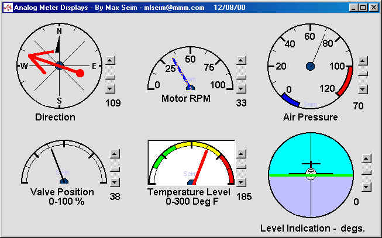



## Analog\_Meter

### Description

Allows you to create your own analog meters using MSpaint.

These images become the meter face. Use the (analogmeter)

subroutine to draw the hand (needle) automatically scaling

the needle to the size of the Picture Box and position the

needle to the engineering unit (value) you wish to display.

Movement is smooth. You can also vary the needle width, color,

and needle length. All of the meter attributes are sent to the

subroutine with each update, allowing the needle color, (for example)

to change as a value increases.

Using the Picture1.Picture property, you can even load in a

different meter face during runtime ... the meter needle and the

meter face to not conflict with each other.

No special ocx's or api's needed. All done with Picture1.Line property.
 
### More Info
 

             |
---                |---
**Submitted On**   |2000-12-08 13:59:58
**By**             |[Max Seim](https://github.com/Planet-Source-Code/PSCIndex/blob/master/ByAuthor/max-seim.md)
**Level**          |Intermediate
**User Rating**    |4.7 (108 globes from 23 users)
**Compatibility**  |VB 5\.0, VB 6\.0
**Category**       |[Complete Applications](https://github.com/Planet-Source-Code/PSCIndex/blob/master/ByCategory/complete-applications__1-27.md)
**World**          |[Visual Basic](https://github.com/Planet-Source-Code/PSCIndex/blob/master/ByWorld/visual-basic.md)
**Archive File**   |[CODE\_UPLOAD124791282000\.zip](https://github.com/Planet-Source-Code/max-seim-analog-meter__1-11472/archive/master.zip)

